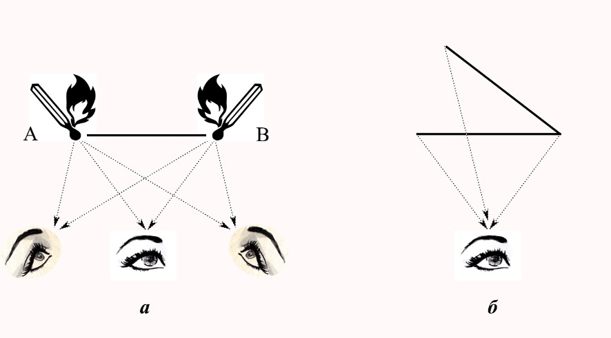
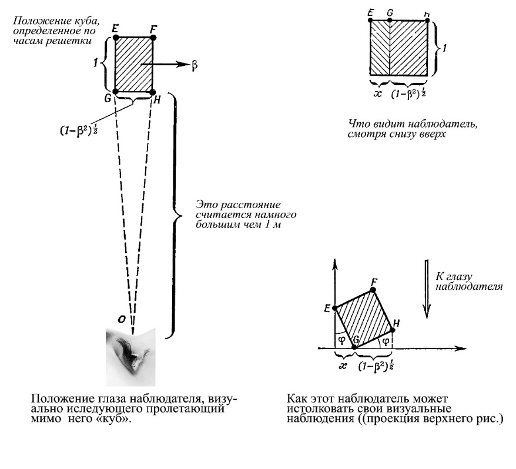
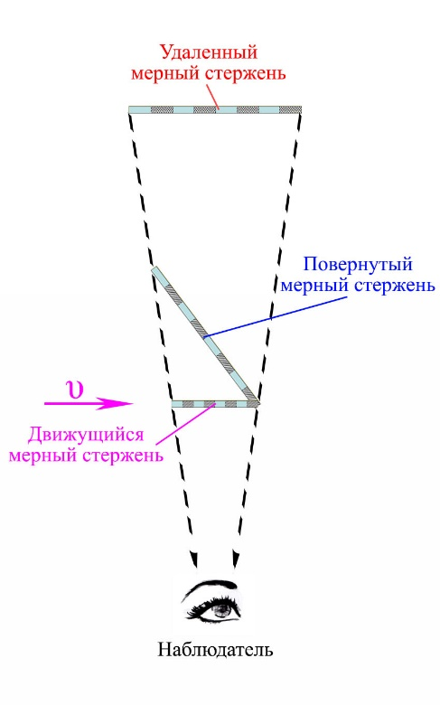
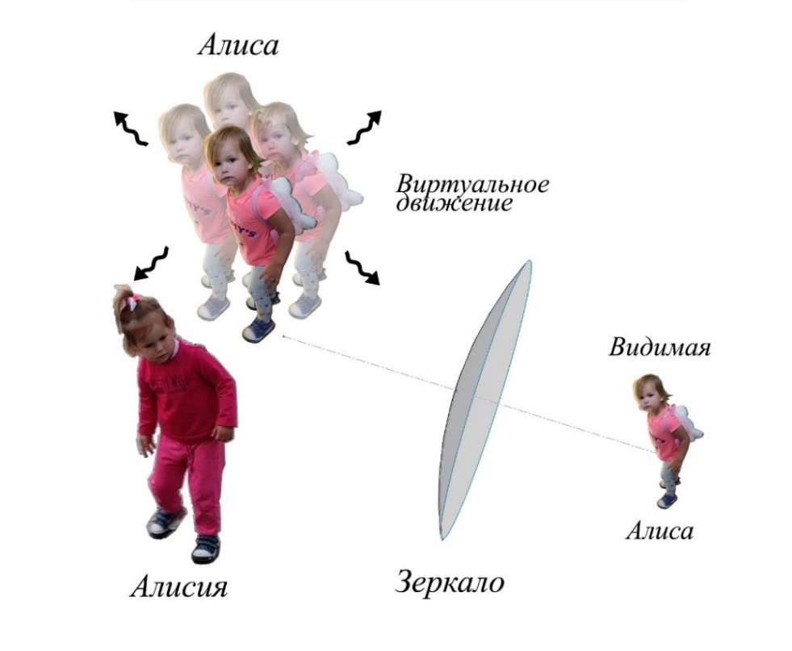
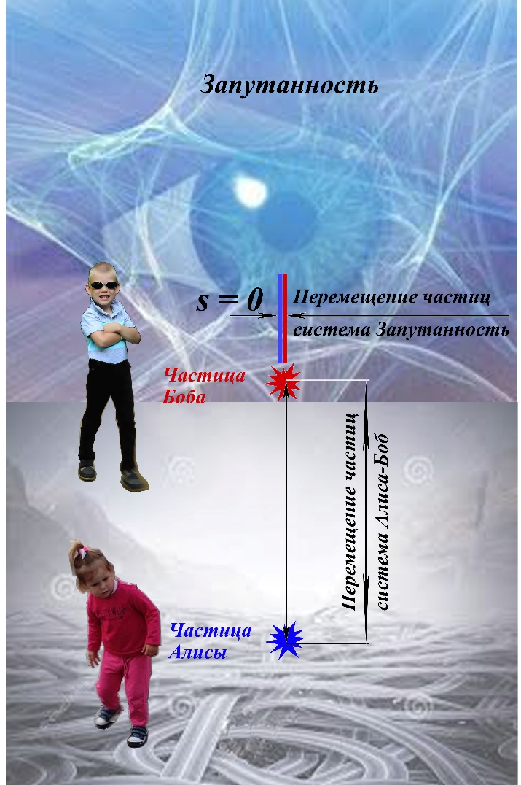
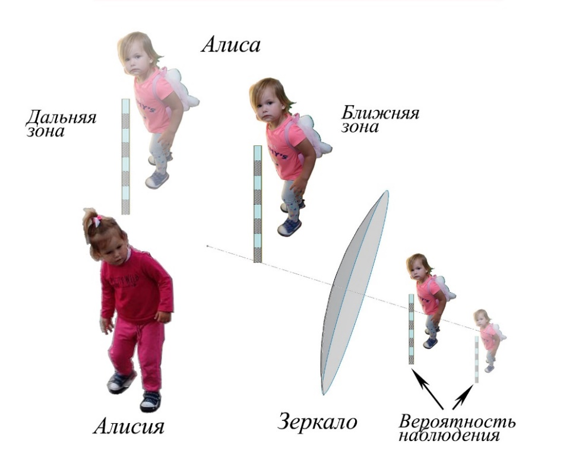
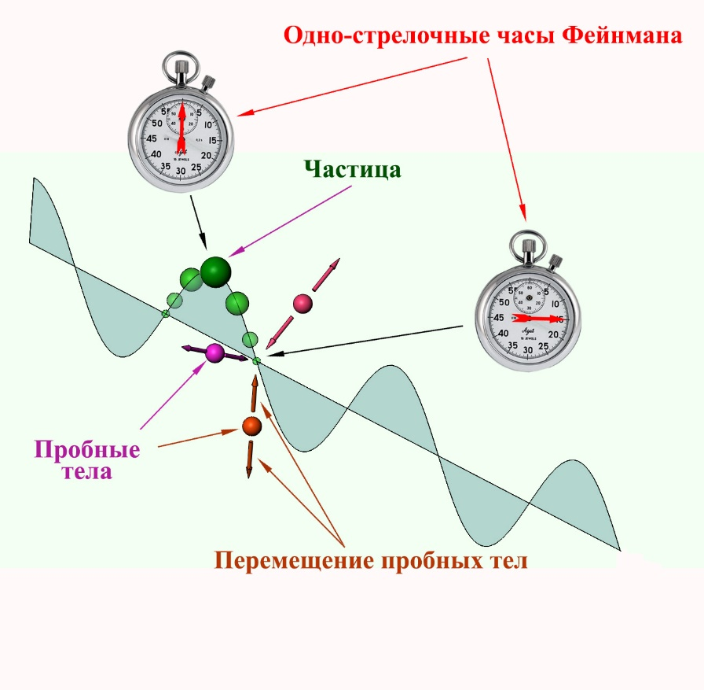
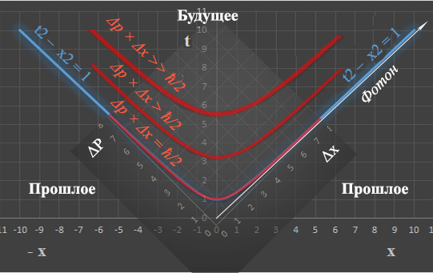
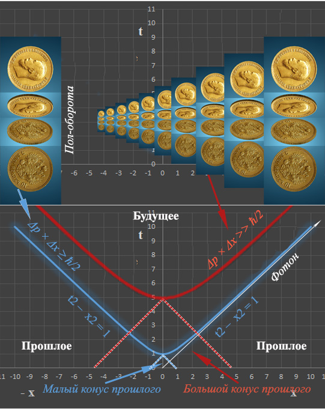
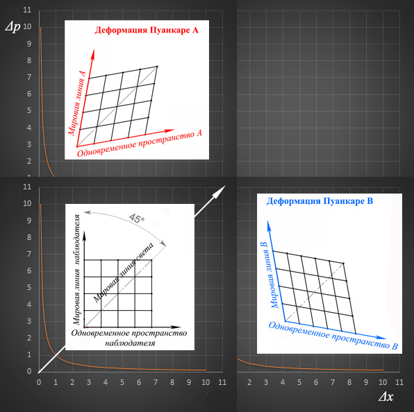

Если Вам доводилось читать знаменитую Эйнштейновскую работу 1905г. «К электродинамике движущихся тел» возможно Вы обратили внимание на формулировку принципа относительности: «1. Законы, по которым изменяются состояния физических систем, не зависят от того, к которой из двух координатных систем, **движущихся** относительно друг друга равномерно и прямолинейно, эти изменения состояния относятся.»[^1].
Дело в том, что этот принцип базируется на законе инерции Галилее-Ньютоновой механики, известном нам со школьной скамьи и звучащий следующим образом: «тело, достаточно удаленное от других тел, пребывает в состоянии **покоя или** равномерного прямолинейного **движения**»[^2] т.е. по определению этот закон охватывает больший спектр явлений.

Причина, по которой была „урезана“ исходная формулировка закона инерции Галилея-Ньютона, с нашей точки зрения, вызвана чистым прагматизмом. В упоминаемой работе, Альберт Эйнштейн для вывода преобразований Лоренца, воспользовался монадным методом задания систем отсчета „отбросив“ из-за „неудобства“ хроногеометрию. Напомним, что система отсчета в которой происходит регистрация приходящих световых сигналов получила название „хроногеометрия“. Соответственно случай, рассматривающий континуум наблюдателей т.е. основанный на конгруэнции временно-подобных мировых линий назван монадным методом[^3].

Следуя духу хроногеометрии, вполне логично предположить, что некоторые эффекты частной теории относительности (ЧТО) имеют право на существование вне относительного движения, т.е. должны наблюдаться в неподвижных системах отсчета. В ЧТО (выражаясь терминами механики) присутствуют кинематические и динамические эффекты. К кинематическим эффектам можно отнести относительную одновременность и сокращение длинны. В отличии от динамического эффекта связанного с различием хода часов в неподвижной и движущейся системах отсчета (при последующей сверке часов выявляется „деформация“ времени) они не сопровождаются какой-либо в последствии обнаруживаемой „деформацией“. В следствии этого, эффекты относительной одновременности и сокращение длинны должны рассматриваться и в неподвижной системе отсчета [рисунок 1](#image1). На [рисунке 1](#image1) а показано, что для левого наблюдателя момент зажигания спички в точке А предшествует аналогичному событию в точке В (свет из этой точки доходит до него позже, чем из А). Правый наблюдатель видит противоположную последовательность событий. Соответственно средний утверждает, что события в А и Б одновременные. На [рисунке 1](#image1) б видно – рассматривая мерный отрезок под некоторым углом, его „видимость“ в соответствии с законами проективной геометрии уменьшится, и он будет „выглядеть“ короче чем исходный не повернутый.

#####  Рисунок 1 – Пример кинематических эффектов относительной одновременности событий и сокращения длины в неподвижной системе отсчета (сюжет Спички с сайта <https://publicdomainvectors.org/en/burning>, сюжет Глаз с сайта <https://yandex.by/collections/card>)

Интуитивно, понятие относительной одновременность для состояния покоя, вполне себе представимо. А вот лоренцево сокращение длинны, для состояния покоя, в представленном выше виде вроде должно выглядеть как-то надуманно. Но, как ни странно, это не совсем так. Аналогичным образом в ЧТО объясняются возможные наблюдения метаморфоз движущегося куба [^4] ([рисунок 2](#image2)). Данное представление основано именно на восприятии наблюдателем движущегося куба как „повернутого” (правая часть [рисунка 2](#image2)).

##### Рисунок 2 – Пояснения к наблюдению движущегося куба (сюжет из книги Э. Тэйлора и Дж. Уилера „Физика пространства-времени“)

Вернемся к правой части [рисунка 1](#image1) и рассмотрим его в более расширенной версии возможных наблюдений ([рисунок 3](#image3)). На нем представлен случай лоренцевого сокращения движущегося стержня, повернутый неподвижный стержень, а также третий случай – удаленный стержень.

##### Рисунок 3 – Три случая наблюдения мерных стержней

Сопоставление этих случаев между собой навело нас на следующее предположение. Если воспользоваться условием наблюдения в ящике Эйнштейна [2] – „не выглядывать из него“, то три этих случая для наблюдателя будут эквивалентными.

В законе инерции Галилее-Ньютоновой механики, основными понятиями являются понятия движения и покоя. В простейшем случая мы приписываем понятию движения такую характеристику как скорость. Соответственно покою –скорость равную нулю. Но величайшие умы человечества на этом не остановились и „изобрели” третий тип движения – виртуальный. Жозеф Луи Лагранж в своей аналитической механике [5], при рассмотрении тел в статическом равновесии использовал три принципа, один из которых является принципом виртуальных скоростей. Напомним его: «Под виртуальной скоростью следует понимать скорость, которую тело, находящееся в равновесии, готово принять в тот момент, когда равновесие нарушено, т. е. ту скорость, какую тело фактически получило бы в первое мгновенно своего движения». В этом высказывании виртуальная скорость – это тенденция равновесия к движению. Ведь хотя в формулировке закона инерции присутствует условие: «тело, достаточно удаленное от других тел…» удалить тело само от себя и рассматривать его вне Вселенной невозможно. Все материальные тела, которые мы рассматриваем, разве не являются результатом равновесия гравитационных, электромагнитных и ядерных сил, а Вселенная четырех известных сил? По сути принципа виртуальной скорости, вся барионная материя (+электроны) является случаем равновесия в условиях нарушения СР – инвариантности в далеком прошлом нашей Вселенной. И если вдруг, из небытия возникнет „утерянная“ антиматерия „наша“ материя „помчится” по вселенной со скоростью света.

Возможно, именно по этой причине геометрия Минковского характеризуется вечным движением со скоростью света если не в пространстве так во времени. Ну и соответственно знаменитая Эйнштейновская Е = mс2. Еще вопрос – скорости света, разве она является свойством фотона? Согласно Джеймсу Кларку Максвеллу, скорость света определяется магнитной и диэлектрической проницаемостью среды
С = 1/𝜀0×𝜇0
т.е. в вакууме, заключена скорость света.

Описание движущихся объектов в ЧТО, при наличия четкого вектора относительного движения, приводит к их „размерной анизотропии“ вследствие лоренцевого сокращения. Но для барионной материи, в свете сказанного выше, виртуальное движение вряд ли предполагает возможность выделения какого-либо преимущественного направления, в этом смысле оно изотропно. Тогда системам отсчета с виртуальным движением должны соответствовать эффекты, несколько отличные от таковых которые наблюдаются в классических системах отсчета, рассматриваемых в ЧТО (с выделенным направлением относительного движения).

В замечательной книге [6] описывается сюжет, в котором Алисия наблюдает за своим отражением (Алисой) в стране за выпуклым зеркалом. На рисунке 4 воспроизведена несколько видоизмененная ситуация такого наблюдения.

##### Рисунок 4 – Алисия и выпуклое зеркало (сюжет из книги Климента Дьюрелла „Азбука теории относительности“)

В нашем случае Алиса вполне себе материальный объект. Она обитает в том же пространство-времени что и Алисия, но обладает по отношению к последней некоторой виртуальной скоростью. Вследствие относительного виртуального движения Алисия наблюдает не истинный размер Алисы, а ее уменьшенный облик. По сути, эта схема – трехмерный вариант наблюдения удаленного мерного стержня (рисунок 3) и возможно подходящее описание компактификации систем отсчета при относительном виртуальном движении.

Рассмотрим нелокальное явление квантовой запутанности с использованием традиционных персонажей – Алисы и Боба рисунок 5. Алиса и Боб получают свои частица (фотоны, запутанные по поляризации) после того, как они преодолели определённый путь до соответствующих детекторов нашей пары. Допустим наши экспериментаторы и их оборудование, состоящие из барионной материи, движутся с виртуальной скоростью равной скорости света относительно системы отсчета Запутанности. В таком случае Запутанность будет „рассматривать“ барионную систему отсчета как бесконечно удаленную т.е. „видеть“ систему отсчета барионной материи как бесконечно малую по величине. С „точки зрения“ Запутанности ни будет никакого перемещения частиц и соответственно не будет между ними какого-либо расстояния. Для квантовой Запутанности (в отличие от нас) возможно не существует проблем с коммуникацией между частицами Алисы и Боба.

##### Рисунок 5 – Относительность перемещения частиц в системах отсчета Алиса-Боб и Запутанность

(сюжет Глаза с сайта https://physicsforme.com/2011/04/30, сюжет Лабиринта с сайта https://fr.dreamstime.com/photo-stock-confusion-image42416675)

Вернемся к триумвирату Алисия-Зеркало-Алиса (рисунок 6). В данном случае для Алисии „видимость“ Алисы будет то больше, то меньше в зависимости от того находится Алиса в ближней или в дальней зоне своей системе отсчета. Если несколько по-другому, то вероятность наблюдения Алисией – Алисы будет завесить от того. в какой части своей системы отсчета последняя находится.

##### Рисунок 6 – Наблюдение Алисией дальней и ближней зон системы отсчета Алисы (сюжет из книги Климента Дьюрелла „Азбука теории относительности“)

Как тут не вспомнить Уильяма Блейка [7]:

В одном мгновенье видеть вечность,

Огромный мир — в зерне песка,

В единой горсти — бесконечность

И небо — в чашечке цветка.

В общем случае вопрос, что мы видим, когда наблюдаем Природу очень любопытен. Основную массу информации человек получает с помощью зрения т.е. с привлечением электромагнитного излучения. Но согласно [8] мир для фотона стягивается в апекс движения и соответственно для ансамбля фотонов мир будет плоским. Возможно, что „глазами“ фотонов (из системы отсчета светового наблюдателя, заданного монадным методом) мы видим в одном случае, когда скорость фотонов становиться сопоставимой с нашей т.е. в окрестностях черной дыры. Напомним, скорость света в гравитационном поле описывается формулой [1]:

с=с01+Фс2

где: Ф – гравитационный потенциал (величина отрицательная),

        с0 – скорость света в начале координат.

(Мы воспроизводим формулу из источника в том виде, в котором она существует на стр.172)

Может быть по этой причине горизонт событий черной дыры представляется нам как „застывшая плоская картина“? Сразу же возникает интересный вопрос, а замедляется ли скорость распространения гравитационного взаимодействия в сильных гравитационных полях? Если нет, то возможно воспользовавшись „гравитационным зрением“ мы бы „увидели“ черную дыру иначе?

В этой связи стоит напомнить [9]: «Частицы и излучение не могут быть зарегистрированы непосредственно, а лишь через их взаимодействие с веществом». Но в последнее время ширится движение под лозунгом – не возмущай измерением. Тогда некоторый интерес может представлять следующий мысленный эксперимент. Рассмотрим движущуюся произвольную частицу (имеющую массу покоя) в терминах значений ее квадрата амплитуды как вероятности и простейшей трактовки в представлении одно-стрелочных часов Фейнмана [10] (рисунок 7). В область, где квадрат амплитуды вероятности стремится к нулю, поместим три пробных гравитационных тела. При пролете мимо них нашей частицы, представимы три следующих случая реакции пробных тел:

- пробные тела переместятся внутрь, в радиальном направлении к траектории движения частицы;

- пробные тела останутся на месте;

- пробные тела переместятся наружу, в радиальном направлении к траектории движения частицы.

##### Рисунок 7 – Мысленный эксперимент с использованием гравитационных пробных тел

Если ничего сильно не усложнять, то первый вариант может соответствовать предположению, что поле Хигса являясь скалярным не обладает волновыми свойствами. Второй вариант. Неравенство Гейзенберга вида ΔЕ × Δt ≥ ħ/2, где ΔЕ – среднеквадратическое отклонение энергии, Δt – среднеквадратическое отклонение временного интервала. Принято трактовать его как возможность появления в вакууме энергии „из ничего“ на время, соответствующее этому неравенству. Но мы не нашли в квантовой механике запрета на существование обратного процесса – энергия может исчезать „в ничто“ на время, соответствующее этому неравенству. Тогда при выборе подходящих базисов (по терминологии физиков) на основе этого неравенства можно создать простейшую периодическую функцию вида cos или sin. Соответственно третий вариант, возможно – область существования интегралов по траекториям Фейнмана (рисунок 6 – мы видим, что Алиса находится либо перед Алисией, либо за ее спиной).

В квантовой механике существует тезис [11] – полное знание о системе не предполагает полного знания о ее составных частях. Предлагаем через призму наивной трактовки этого высказывания взглянуть на пару запутанных по поляризации фотонов с рисунка 5. У Алисы есть два варианта, при наблюдении фотонов с регистрацией их (допустим) по базису вертикальной поляризации. Она получит фотон с поляризацией верх либо фотон с поляризацией вниз. Если обозначить измеренную поляризацию – 1 и соответственно противонаправленую – 0 можно записать:

1↑ + 0↓ = 1 = const

0↑ + 1↓ = 1 = const

Тогда правая часть равенств будет соответствовать полноте знаний о системе (мы знаем, что получим либо первый, либо второй результат). Левая часть – это неполнота знания о составных частях системы (мы не знаем какой именно в данный конкретный момент выпадет результат). В правой части мы выписали const в знак того, что полное знание не меняется (всегда const).

Посмотрим на все это под другим углом. По своей структуре ЧТО является локальной теорией. Но ведь это теория ОТНОСИЕЛЬНОСТИ. Теория относительности локальна только в той степени и в той мере, в которой мы ее рассматриваем с точки зрения локального наблюдателя. По сути, локальность в ней связана с тем фактом что Homo vigiläbö (человек наблюдающий) воспринимает только изменения в окружающем мире, а ограничение скорости распространения любых изменений скоростью света и приводит к локальности. Если Homo vigiläbö не наблюдает каких-либо изменений, то и смысла в скорости света как фактора ограничения передачи сигналов нет. В условиях невозможности изменения чего-либо локальность существовать не может. В этом смысле мы живем в существенно нелокальном мире. Примеров вокруг сколь угодно: мировые константы – скорость света, гравитационная постоянная, постоянная тонкой структуры, постоянная Планка. Сюда же можно добавить тождественность и массу покоя элементарных частиц. И в этом же смысле у двух запутанных по поляризации фотонов ничего не меняется (у второго всегда противоположная поляризация). Сделаем очевидное допущение: мировые константы – это свойство вакуума. Но согласно [12] вакуум не может служить системой отсчета. Тогда мировые константы необходимо рассматривать как псевдо-системы отсчета.

Вопрос – что есть траектория? – озвучивал еще Эйнштейн [2]: «Я стою у окна равномерно движущегося вагона железной дороги и роняю на полотно дороги камень, не давая ему никакого толчка. Тогда я вижу (не принимая в расчет влияния, оказываемого сопротивлением воздуха), что камень падает прямолинейно. Пешеход, который наблюдает мое действие со своей тропинки, замечает, что камень падает на землю, описывая дугу параболы. Теперь я спрашиваю: где «в действительности» лежат «места», которые пробегает камень на прямой или на параболе?». И это завораживающий своей красотой вопрос. Но вернемся к движению тел в общей теории относительности, согласно теории, движение тел в искривлённом пространство-времени происходит по геодезическим. Тела искривляют ткань пространство-времени, а искривлённое пространство-время формирует траекторию тела. Таким образом траекторию движения тел определяет искривление пространство-времени. К этому добавим вопрос – как „удлинились“ реликтовые фотоны? Разве их траектория не „растянулась“ вместе с расширением Вселенной?

Суммируя все вышеперечисленное, мы неизбежно возвратимся к тривиальной мысли, что квантовая запутанность и волновые свойства – это не данность частицы, а свойство вакуума (пространство-времени?).

Другой вопрос – вопрос случая. В одной из публикаций [13] был показан пример совмещения области действительных значений неравенства Гейзенберга и области будущего в плоском представлении мировых событий в терминах геометрии Минковского. В нашей схеме, изображенной на рисунке 8, область действительных значений неравенства Гейзенберга представлена как совокупность кривых, соответствующих определённому моменту времени в будущем. Глядя в него (в будущее), мы будем наблюдать рост значения в левой части неравенства от величины ħ/2 до значений, которые будут соответствовать уже классической неопределенности макротел – Δp × Δx >> ħ/2, где Δp – среднеквадратическое отклонение импульса, Δx – среднеквадратическое отклонение координаты.

##### Рисунок 8 – Рост значения неопределённости в потенциальном будущем

Приведем пример с подбрасыванием монеты (рисунок 9). Если ее подбрасывать не сильно, то она, сделав пол оборота постоянно будет падать на поверхность не случайным образом. В момент, когда мы подбрасываем ее сильнее, мы получаем (в будущем) значение в левой части неравенства Гейзенберга величиной достаточной для придания неопределённости в положении граней монеты. Одна из возможных трактовок по чему так происходит проста. В каждом конкретном случае мы должны учитывать все события находящееся в конусе прошлого данного события. Таково требование принципа причинности [14].

##### Рисунок 9 – Подбрасывание монеты (сюжет Монеты с сайта https://egor-23.livejournal.com/581944.html)

Но естественно может возникнуть вопрос о совмещении области действительных значений неравенства Гейзенберга и области будущего в геометрии Минковского. Ведь если посмотреть на график неравенства Гейзенберга на рисунке 10, то вдоль оси абсцисс (в нашем случае) происходит рост значения Δx (среднеквадратическое отклонение координаты), а вдоль ординаты значения Δp (среднеквадратическое отклонение импульса) и график получается не симметричный. На наш взгляд, эту не-симметрию логично было бы трактовать с использованием понятия деформации Пуанкаре.

##### Рисунок 10 – Неравенство Гейзенберга и деформация Пуанкаре

P.S. Если рассматривать пример с подбросом монеты в свете изложенной выше наивной трактовки тезиса Шредингера о полноте общего и неполноте частного, различия при сопоставлении со случаем квантовой запутанностью фотонов мы не обнаружим.

1 (Орел) ↑ + 0 (Решка) ↓ = 1 = const

0 (Орел) ↑ + 1 (Решка) ↓ = 1 = const

#### Литература

[^1]: А. Эйнштейн. Собрание научных трудов. Работы по теории относительности. 1905-1920. т.1 / Е.И. Тамма. М. Наука. 1965. с. 702.

[^2]: А. Эйнштейн. О специальной и общей теории относительности: Пер. с 12 изд. / С.Я. Лифшица. М. Государственное издательство. 1922. с. 80.

[^3]: Ю. С. Владимиров. Системы отсчета в теории гравитации. М. Энергоиздат. 1982.с. 256.

[^4]: Э. Тэйлор., Дж. Уилер. Физика пространства-времени. Пер. с англ. М. Мир. 1971. с.320.

[^5]: Ж. Лагранж. Аналитическая механика. т. 1. Пер. с франц. / Л. Г. Лойцянского. М. Государственное издание технико-теоретической литературы. 1950. с. 594.

[^6]: К. Дьюрелл. Азбука теории относительности. Пер. с англ. М. Мир.1970. с. 154.

[^7]: Уильям Блейк. Избранное. Пер. с англ.М.«ОЛМА-ПРЕСС».2000. с. 81.

[^8]: Р.Ф. Полищюк Современная картина мира. http://www.chronos.msu.ru /old/ RREPORTS /polischuk_kartina.pdf

[^9]: К. Групен. Детекторы элементарных частиц. Справочное издание. Пер. с англ. Н. Сибирский хронограф. 1999. с. 408.

[^10]: Р. Фейнман.  КЭД – странная теория света и вещества: Пер. с англ. М. Наука. Гл. ред. физ.-мат. лит. 1988. с. 144.

[^11]: E. Schrödinger. The Present Status of Quantum Mechanics. https: //homepages.dias.ie /dorlas/Papers /QMSTATUS.pdf

[^12]: А. Д. Чернин. Темная материя и всемирное антитяготение.// Успехи физических наук. Т.178. №3. с. 267-300.

[^13]: И. О. Сазоненко., В. И. Сазоненко. Частная теория относительности: взгляд стороннего наблюдателя. //Литье и металлургия. №4. 2019. с. 26-30.

[^14]: Э. Шредингер. Наука и гуманизм. Ижевск. НИЦ. «Регулярная и хаотическая динамика». 2001. с. 64.
